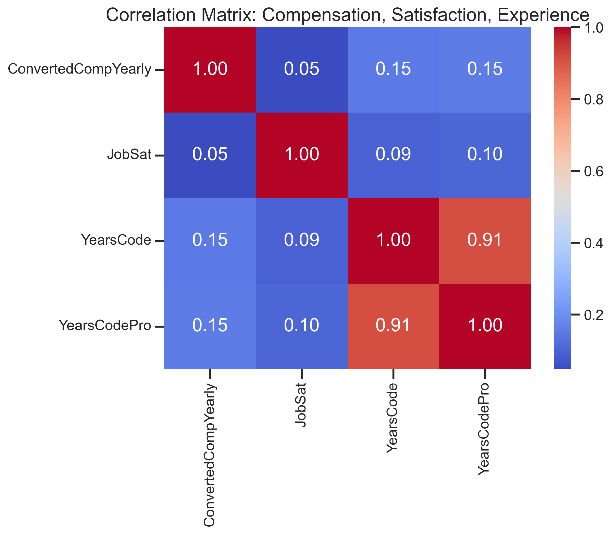
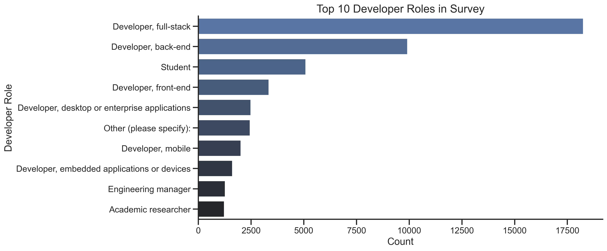

# Beyond the Code: The Global Developer Landscape in 2024

## A Data-Driven Journey Through the Developer Ecosystem

---

## Introduction: The Digital Architects of Our World

In today's technology-driven world, software developers are the architects building the digital infrastructure that powers our daily lives. From the apps on our phones to the complex systems managing global finance, these professionals shape how we interact with technology. But who exactly are these developers? What tools do they use? How do they work and learn? And perhaps most importantly, what can this tell us about the future of technology?

To answer these questions, I dove deep into the Stack Overflow Annual Developer Survey 2024, analyzing responses from over 65,000 developers across the globe. This analysis reveals a comprehensive picture of the developer ecosystem, highlighting trends that impact how companies hire, how educational institutions train the next generation, and how technology itself evolves.

Join me on this data-driven journey as we explore the people behind the code and uncover the patterns shaping our digital future.

---

## Part 1: The Developers of Today

### The Age Spectrum: Youth Leads the Way

The first question we might ask is: **Who are today's developers?** Looking at the age distribution reveals a profession dominated by youth and mid-career professionals:

- **25-34 year-olds form the backbone** of the global developer workforce (~24,000 developers)
- **Strong representation from 35-44 year-olds** (~15,000) and **18-24 year-olds** (~14,000)
- **Sharp decline after age 45**, with significantly fewer developers in older age brackets

This age profile tells an important story about the industry's evolution. The concentration of developers in the 25-44 age range suggests that while programming remains accessible to newcomers, it's become a mature profession with established career paths rather than just a hobby or temporary occupation.

The presence of developers under 18 signals early entry paths into the field, while the drop-off after 45 raises important questions about career longevity and the challenges of keeping skills current in a rapidly evolving technological landscape.

### Experience Levels: The Great Influx

When we examine experience levels, an even more interesting pattern emerges:

- **Professional experience peaks at 0-1 years** (~23,000 developers)
- **Total coding experience peaks at 5-10 years** (~10,000 developers)
- **Consistent gap between total and professional experience** across all ranges

This reveals a massive influx of new professionals entering the developer workforce. The substantial gap between total coding experience and professional experience demonstrates that many developers build their skills for years before entering professional roles.

The long tail extending to 40+ years of experience represents a small but important cohort of veterans who have witnessed and shaped the entire evolution of modern computing.

### Education: Multiple Paths to Success

The traditional path to becoming a developer has typically involved formal higher education, and our analysis confirms this pattern continues:

- **Bachelor's degrees dominate** the field (~25,000 developers)
- **Master's degrees are remarkably common** (~15,000 developers)
- **Nearly 8,000 developers have some college without completing a degree**
- **Secondary education only** represents ~5,000 developers

What's notable is the diversity of educational backgrounds. While university degrees remain the primary pathway, the significant number of developers with incomplete degrees or only secondary education demonstrates that formal credentials aren't universal barriers to entry.

This educational diversity reflects the industry's growing recognition that skills and practical ability often matter more than formal qualifications.

---

## Part 2: The Technology Landscape

### Languages: JavaScript's Continued Reign

The tools developers use provide insight into current industry priorities and future directions:

- **JavaScript maintains dominance** with ~36,000 users
- **HTML/CSS follows closely** with ~31,000 users
- **Python and SQL show nearly identical adoption** (~30,000 users each)
- **TypeScript** (~24,000 users) has firmly established itself in the mainstream

JavaScript's continued dominance reflects the web's centrality to modern computing. However, Python's strong showing demonstrates the growing importance of data science, machine learning, and automation.

TypeScript's rise represents a significant shift toward type safety and better tooling in web development, indicating how the JavaScript ecosystem is maturing to handle increasingly complex applications.

### Frameworks: Node.js and React Lead the Pack

The framework ecosystem reveals even clearer patterns of technology adoption:

- **Node.js dominates** with ~20,000 users
- **React follows closely** with ~19,000 users
- **jQuery persists** with ~10,500 users despite its age
- **Next.js, Express, Angular, and ASP.NET Core** form a strong middle tier

The continued dominance of Node.js and React points to the JavaScript ecosystem's central role in modern development. The persistence of jQuery, despite newer alternatives, demonstrates the significant inertia in technology adoption - established codebases don't disappear overnight.

The emergence of Next.js in the top frameworks indicates the industry's move toward more integrated, opinionated solutions that address common pain points in web development.

### Databases: PostgreSQL Takes the Crown

In the database world, a clear hierarchy has emerged:

- **PostgreSQL leads decisively** with ~25,000 users
- **MySQL remains strong** with ~21,000 users
- **SQLite's high adoption** (~17,000 users) highlights the importance of embedded solutions
- **MongoDB** (~13,000 users) maintains its position as the leading NoSQL option

PostgreSQL's rise to the top position signals a shift in database preferences, likely driven by its robust feature set, reliability, and strong SQL standard compliance. 

The continued strength of relational databases (PostgreSQL, MySQL, SQLite, SQL Server, MariaDB) demonstrates that despite the NoSQL movement, structured data and SQL remain fundamental to most applications.

---

## Part 3: The Working Life of Developers

### Work Arrangements: The Hybrid Revolution

Perhaps no aspect of developer work has changed more dramatically in recent years than where and how they work:

- **Hybrid arrangements dominate** with ~23,000 developers
- **Remote work follows closely** with ~21,000 developers
- **In-person arrangements** represent a minority with ~11,000 developers

The data reveals a profound shift in work arrangements, with flexible options (hybrid + remote) accounting for approximately 80% of all developer work setups. This revolution in work arrangements has significant implications for office space, team collaboration tools, and geographic hiring strategies.

The traditional office-only model has clearly shifted to minority status, suggesting that the pandemic-induced changes in work patterns have become permanent features of the developer landscape.

### Work Arrangements by Age: Different Generations, Different Preferences

Diving deeper into work arrangements, we see interesting patterns across age groups:

- **Hybrid dominates the 25-34 bracket** (~9,700 respondents)
- **Remote work peaks with 35-44 year olds** (~6,300 respondents)
- **Young developers (<25)** show more balanced preferences across arrangements
- **In-person preference decreases with age** across most groups

These patterns suggest that work arrangement preferences vary significantly with career stage and life circumstances. Young developers may value in-person mentorship and socialization, while mid-career professionals with family responsibilities may prioritize the flexibility of remote work.

### Job Satisfaction: Size Doesn't Matter (Much)

How satisfied are developers with their jobs, and does company size affect satisfaction?

- **Smallest organizations excel**: Freelancers and tiny companies report highest satisfaction
- **Consistent satisfaction band**: Most company sizes cluster around 6-7 on a 10-point scale
- **No clear downward trend** with increasing company size
- **All company sizes show maximum ratings near 10**

The data challenges the notion that smaller companies inherently offer better developer experiences. While the smallest organizations do show slightly higher median satisfaction, the consistent band across company sizes suggests that factors beyond company size—such as team dynamics, project interest, and individual autonomy—likely have greater impact on job satisfaction.

### What Drives Satisfaction? Not Just Money

When we examine the correlations between key variables, surprising patterns emerge:

- **Money doesn't buy happiness**: Compensation and job satisfaction show negligible correlation (0.05)
- **Experience yields modest financial returns**: Coding experience correlates weakly with compensation (0.15)
- **Experience barely influences satisfaction**: Years of experience shows minimal correlation with job satisfaction (0.09-0.10)

These weak correlations challenge conventional wisdom about what drives developer career satisfaction. The negligible relationship between compensation and satisfaction suggests that once basic financial needs are met, other factors like autonomy, mastery, purpose, and work-life balance likely play more important roles in job satisfaction.

---

## Part 4: Regional Perspectives

### Experience Across Borders: Uneven Distribution

Developer experience is not distributed evenly across the globe:

- **US and UK lead with deepest experience pools** (highest medians ~8 years)
- **Netherlands shows highest median** (~9 years) among continental European nations
- **India displays the youngest developer workforce** (median ~3 years)
- **Poland and Ukraine** represent growing tech hubs with newer talent pools (medians ~5-6 years)

This uneven distribution tells a story of industry maturity and growth patterns. The US and UK's deeper experience pools reflect their status as early adopters of software development. India's younger workforce signals its position as an emerging tech power experiencing rapid growth and new talent influx.

All countries show veteran outliers with 40+ years of experience, demonstrating the global reach of the earliest waves of programming pioneers.

### Compensation vs. Experience: Geography Trumps Tenure

One of the most striking findings is the relationship between geography, experience, and compensation:

- **Location has far greater impact on compensation than years of coding experience**
- **Nordic/Oceania premium** evident with Australia (~$95K) and Denmark (~$90K) commanding top compensation
- **Distinct compensation bands** form regardless of experience:
  - **Top tier** ($85K-95K): Australia, Denmark, Canada
  - **Upper-middle** ($65K-75K): Germany, Cyprus, Belgium, Estonia
  - **Lower-middle** ($30K-50K): Croatia, Chile, Argentina, China
  - **Bottom tier** (<$20K): Bangladesh, Egypt, Ghana, Algeria, Afghanistan

The stark 10x compensation gap between highest and lowest regions for similar experience levels reveals how profoundly geography impacts developer economics. This has important implications for remote work, global talent strategies, and individual career decisions.

### The Global Value Proposition: Affordability Champions

When we adjust for cost of living, unexpected champions emerge:

- **Israel leads decisively** with the highest affordability score (~2500)
- **Middle East emerges as affordability leader** with Israel and Saudi Arabia claiming top positions
- **Uruguay stands out** as Latin America's representative (~2200)
- **Unexpected contenders** include Georgia (~2100) and Romania (~2050)
- **Notable absence** of traditional tech powerhouses like the US, UK, and Western European nations

This affordability analysis reveals surprising "sweet spots" where developer compensation provides exceptional local purchasing power. Countries like Israel, Saudi Arabia, and eastern European nations offer compelling economic value propositions that challenge the traditional dominance of Silicon Valley and other established tech hubs.

### Local Purchasing Power: The Three-Tier World

Looking at local purchasing power reveals a starkly divided developer economy:

- **Australia leads dramatically** (~130 index) with highest developer purchasing power
- **Western European strength** shown by Belgium (~115) and Austria (~105)
- **Bulgaria bridges the gap** (~75) between Western economies and emerging markets
- **Latin American struggle** evident with Argentina (~45) and Brazil (~40)
- **Bangladesh and Algeria rank lowest** (~35 and ~30)

These differences create a three-tier world for developers: premium Western markets (100+), mid-range emerging tech hubs (60-80), and challenging markets (30-45). This economic stratification helps explain global migration patterns and the flow of tech talent from lower to higher-tier countries.

---

## Part 5: Learning and Development

### How Developers Learn: The Digital Shift

Understanding how developers acquire skills provides insight into the evolving education landscape:

- **Informal online resources dominate** (~48,000 respondents)
- **Books/physical media maintain relevance** (~30,000)
- **Structured online courses** (~30,000) and **traditional schooling** (~29,000) show robust adoption
- **On-the-job training** (~26,000) highlights workplace learning importance

The overwhelming dominance of informal online resources signals a fundamental shift in professional education, with self-directed learning through documentation, tutorials, Stack Overflow, and other online resources forming the backbone of developer skill acquisition.

The continued relevance of books alongside digital resources suggests that deeper, more structured learning still plays an important role despite the shift to online materials.

### Developer Roles: Full-Stack Dominance

The distribution of developer roles reveals industry priorities and specialization patterns:

- **Full-stack developers dominate overwhelmingly** (~18,000 respondents)
- **Backend specialists** (~10,000) represent the second largest group
- **Students form a significant cohort** (~5,000)
- **Frontend specialists** (~3,000) show surprisingly lower numbers than backend

The overwhelming preference for full-stack developers suggests that the industry values versatility and broad technological competence over deep specialization. This trend toward "T-shaped" developers (broad knowledge with deep expertise in select areas) reflects the complexity of modern applications that span multiple technology layers.

The strong presence of students indicates a robust pipeline of new talent entering the field, ensuring continued growth and renewal of the developer workforce.

---

## Part 6: Future Directions

### Emerging Technologies: Deepening Existing Skills

Looking at the technologies developers plan to adopt reveals future priorities:

- **Established languages lead "emerging" plans** with Python (~25,000) and JavaScript (~24,000)
- **TypeScript's strong position** (~20,000) reflects continued movement toward type safety
- **Rust stands out** (~17,000) as the highest-ranked truly emerging language
- **AWS remains the cloud platform of choice** (~18,000)

Interestingly, developers appear more focused on deepening expertise in established technologies than adopting novel ones. This suggests a maturation of the field, where mastery of fundamental technologies often provides more value than chasing the newest trends.

The strong showing for Rust highlights industry interest in performance and memory safety, potentially signaling a shift in system programming priorities. Meanwhile, TypeScript's momentum confirms the trend toward more robust, type-safe development practices.

---

## Conclusion: The New Normal

The comprehensive analysis of the Stack Overflow Developer Survey 2024 reveals a profession in transition:

1. **Demographic Shift**: A profession dominated by younger developers but with increasing career longevity and multiple entry paths

2. **Technology Consolidation**: Core technologies (JavaScript, Python, SQL) strengthening their position while adding mature features like type safety and improved tooling

3. **Work Transformation**: Hybrid and remote work establishing a new normal, with implications for collaboration, geographic hiring, and workspace design

4. **Global Stratification**: Developer economics showing stark regional variations, creating distinct tiers of opportunity and challenges worldwide

5. **Learning Revolution**: Self-directed, online learning becoming the primary mode of skill acquisition, complemented by traditional education

6. **Role Evolution**: Versatility (full-stack development) valued over deep specialization, reflecting complex application requirements

These insights have profound implications for developers planning their careers, companies crafting hiring strategies, educational institutions designing curricula, and policymakers working to foster technological innovation.

The developer ecosystem continues to evolve, but the data suggests we've reached a new equilibrium in many areas—a "new normal" characterized by flexible work arrangements, consolidated technology choices, and globally distributed talent. Understanding these patterns is essential for anyone looking to navigate the complex landscape of software development in 2024 and beyond.

---

## Methodology

This analysis examined responses from 65,437 participants in the Stack Overflow Annual Developer Survey 2024, supplemented with cost of living data from Numbeo's Cost of Living Index 2024.

Data cleaning involved converting string representations to appropriate numeric types and handling missing values. For multi-response fields (separated by semicolons), custom functions were used to split and count individual responses.

Geographic analysis focused primarily on countries with sufficient response volumes (typically 50+ responses) to ensure statistical validity. Company categorization was performed using a custom function to group organization sizes into meaningful categories (Startup, Mid-sized, Enterprise).

All visualizations were created using Python with Matplotlib and Seaborn, following a consistent color palette and styling for visual coherence.

---

*This analysis was conducted by [Your Name] in [Month Year]. For questions or further discussion, please contact [maqbuul@outlook.com] or connect on [LinkedIn/GitHub/Twitter].*